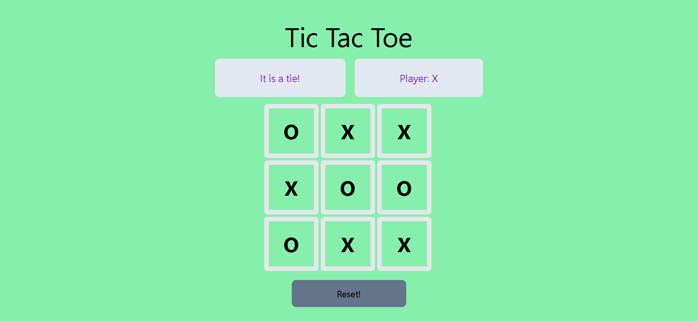

# TicTacToe On the Go!

This is a simple tictactoe game that can be played anywhere with a friend!

## Table of Contents

- [Getting Started](#getting-started)
  - [Installation](#installation)
- [Usage](#usage)
- [Screenshots](#screenshots)
- [Technologies Used](#technologies-used)
- [Future Improvements](#future-improvements)

## Getting Started

### Installation

Provide step-by-step instructions on how to set up your project.

1. Clone the repository:

```bash
    git clone https://github.com/smzalam/your-project.git
```
2. Install backend dependencies

```bash
    cd TicTacToe/backend
    python3 -m venv venv
    source venv/bin/activate  # On Windows: .\venv\Scripts\activate
    pip install -r requirements.txt
```
3. Install frontend dependencies

```bash
    cd TicTacToe/client
    npm install
```

# Usage

Run the following commands:
```bash
    # For running backend
    cd TicTacToe/backend
    source venv/bin/activate  # On Windows: .\venv\Scripts\activate
    python main.py

    # For running Vite React frontend
    cd TicTacToe/client
    npm run dev
```

Play the game!

# Screenshots





# Technologies Used

Flask was used for the backend to spin up a quick and simple backend API for the TicTacToe game. Blueprints were used with the API to have as much of a modular backend as possible.

For the frontend, React with Tailwind CSS was used. Vite was used as the bundling and development server tool.
React hooks such as (useEffect and useState) were used to handle state and page updates. 

Axios was utilized to connect the backend and the frontend.

# Future Improvements
The game could be improved in the future in mnay ways:
1. Adding options for the players to enter their own usernames at the start of the game 
2. Making the game multiplayer so players on two different devices could play on the same game simultaenously
3. Using an actual SQL database to store the gamestate, allowing for multiple games to happen at the same time
4. Adding authentication which could then lead to other features such as leaderboards, saving game results and history, and challenging friends to games

All these features would improve this simple game and make it into a full game application that could be used for many other uses.